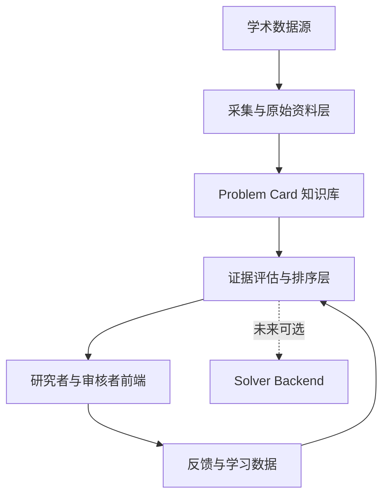

# AI 数学开放问题"抽卡"系统 · 系统架构（System Architecture）

> **文档版本**：v1.0.0
> **文档状态**：基线拆分稿（源：设计规范 v0.1 §6、§7、§17、§18）
> **更新日期**：2026-08-28
> **上游基线**：`AI_Math_Problem_Draw_Agent_Design_Spec_v0.1 (1).md`（只读；本文档为其忠实拆分，不新增技术承诺、不改变任何决策）
> **产品边界与术语**：见《docs/00_PRODUCT_CHARTER.md》

---

## 1. 总体架构与五大业务区

### 1.1 总体架构图



### 1.2 五个核心业务区

| 分区 | 主要能力 | 第一版优先级 |
|---|---|---:|
| A. 问题发现区 | 数据源接入、候选发现、原始资料保存 | P0 |
| B. 知识加工区 | 规范化、分类、去重、关系识别 | P0 |
| C. 审核与评分区 | 开放状态、证据、专家判断、排序 | P0 |
| D. 抽卡推荐区 | 用户画像、卡池、搜索、阅读、收藏 | P0 |
| E. 反馈与学习区 | 纠错、成对比较、行为标签、未来训练集 | P1 |

### 1.3 未来执行层

未来的求解 Harness 是外部可插拔执行器，不拥有 Problem Card 的主数据权。核心系统只通过稳定接口提交问题并接收运行记录（接口定义见本文档第 3.3 节）。

---

## 2. 推荐技术栈

### 2.1 前端

| 能力 | 建议技术 |
|---|---|
| 语言与框架 | TypeScript、React、Next.js |
| 基础交互组件 | Radix UI 或其他 headless primitives |
| 数据请求 | TanStack Query |
| 数学公式 | KaTeX，必要时兼容 MathJax |
| 状态管理 | 优先服务端状态；复杂本地状态再使用轻量 store |
| 可视化 | 原生 SVG / Canvas；只在关系图确实有价值时使用 |
| 测试 | Vitest、Testing Library、Playwright |

不得直接套用完整 SaaS Dashboard 主题。视觉层应建立独立设计 token、排版和问题卡组件系统。

### 2.2 后端

| 能力 | 建议技术 |
|---|---|
| 语言 | Python |
| API | FastAPI |
| Schema | Pydantic |
| ORM | SQLAlchemy |
| 数据库迁移 | Alembic |
| 主数据库 | PostgreSQL |
| 语义检索 | pgvector |
| 缓存/队列 | 第一版按需使用 Redis |
| 定时任务 | 系统 cron 或轻量工作流；复杂后再引入 Prefect |
| 测试 | pytest、property-based tests、API contract tests |

### 2.3 文献与内容处理

- HTML 正文提取；
- PyMuPDF 处理 PDF；
- 复杂学术 PDF 后续使用 GROBID；
- 优先保存 LaTeX 源码；
- DOI、arXiv ID、OpenAlex ID 和内部实体 ID 对齐；
- 原始网页、PDF、JSON 和模型输入快照存入对象存储。

### 2.4 模型与机器学习

- 自定义薄层 `ModelClient`，不让业务逻辑直接依赖厂商 SDK；
- 所有 Agent 输出必须满足 Pydantic/JSON Schema；
- embedding 用于语义检索和疑似重复召回；
- 第一版使用规则、LLM rubric 和专家比较；
- 积累标签后使用 Bradley–Terry、逻辑回归、LightGBM 或 Learning to Rank；
- 跨领域比较需要分领域归一化或层级模型；
- 未获得真实求解结果前，不训练"成功概率"模型。

机器学习路线的分阶段展开（冷启动、专家排序学习、真实求解结果学习、个性化推荐）见设计规范 §14。

### 2.5 部署

第一版建议单体应用部署：

```text
Web Frontend
API Backend
Background Worker
PostgreSQL + pgvector
Object Storage
```

使用 Docker Compose 即可完成课题组内部部署。第一版不需要 Kubernetes 或微服务架构。

---

## 3. DeepSeek Harness 边界

### 3.1 第一版结论

第一版核心系统不依赖 DeepSeek Harness。

原因：

- 第一版没有完整求解 loop；
- 数据库、证据和排序逻辑应长期稳定；
- Harness 仍可能快速变化；
- 强依赖会把产品主数据绑在某一执行框架；
- 推荐系统和求解系统的生命周期不同。

### 3.2 可以怎样使用

- 可以使用 DeepSeek Harness 辅助开发本项目；
- 可以将采集、分析任务做成可选插件；
- 第二版可以将其作为 Solver Backend；
- 可以利用其 session trace 记录未来求解过程；
- 不允许 Harness 直接修改已发布 Problem Card。

参考：

- 官方页面：<https://deepseek.com/harness/en/>
- GitHub：<https://github.com/deepseek-ai/deepseek-harness>

### 3.3 稳定适配接口

```python
class SolverBackend:
    def submit(self, problem, profile, budget): ...
    def status(self, run_id): ...
    def get_trace(self, run_id): ...
    def cancel(self, run_id): ...
```

未来适配器可以包括：

```text
DeepSeekHarnessBackend
CodexBackend
ClaudeCodeBackend
LocalScriptBackend
LeanBackend
```

适配器必须将外部运行记录转换为项目自己的 Attempt Schema（已落地为 `schemas/attempt/schema.json` v1.0.0，见本文档第 5 节）。

---

## 4. API 边界草案

> 本节为草案：仅约定端点路径与一个请求示例，具体请求/响应 Schema 见文末"待裁决问题"。

### 4.1 Problem API

```text
GET    /api/problems
GET    /api/problems/{problem_id}
GET    /api/problems/{problem_id}/versions
GET    /api/problems/{problem_id}/evidence
GET    /api/problems/{problem_id}/relationships
POST   /api/problems/{problem_id}/feedback
```

### 4.2 Draw API

```text
POST   /api/draws
GET    /api/draws/{draw_id}
POST   /api/draws/{draw_id}/reroll
POST   /api/draws/{draw_id}/events
```

`POST /api/draws` 请求示例：

```json
{
  "profile_id": "PROFILE-001",
  "mode": "balanced",
  "pool": "mixed",
  "count": 5,
  "exclude_problem_ids": []
}
```

响应中的每个问题必须包含 `recommendation_reasons` 和 `evidence_confidence`。

### 4.3 Review API

```text
GET    /api/reviews/queue
POST   /api/reviews/{review_id}/decision
POST   /api/reviews/{review_id}/escalate
GET    /api/reviews/{review_id}/context
```

### 4.4 Source and Pipeline API

```text
GET    /api/sources
POST   /api/sources
POST   /api/sources/{source_id}/sync
GET    /api/pipeline/runs
GET    /api/pipeline/runs/{run_id}
POST   /api/pipeline/runs/{run_id}/retry
```

所有写接口必须鉴权并记录审计事件。

---

## 5. 与本仓库实际交付物的对应说明

截至 2026-08-28，本仓库中与本架构文档直接对应的交付物状态如下：

### 5.1 已落地：schemas/ 目录（六族 JSON Schema v1.0.0）

| 目录 | 对应设计规范章节 | 内容 |
|---|---|---|
| `schemas/problem_card/` | §9.1 | 问题卡核心模式（原始陈述不可覆盖、证据先于分数） |
| `schemas/evidence/` | §5.1、§11.2 | 证据条目模式（区分来源事实 / 程序计算 / Agent 推断 / 人类判断） |
| `schemas/review/` | §12 P7 | 专家审核决定模式（专家原始决定不可被后续 Agent 覆盖） |
| `schemas/attempt/` | §14.3 | 求解尝试记录模式（问题 + 模型 + Harness + 工具 + 预算缺一不可） |
| `schemas/source_registry/` | §8.2 | 数据源登记条目模式（先注册、再采集） |
| `schemas/agent_task_contract/` | §11.1 | 标准化 Agent 任务契约模式（Agent 无权静默发布、覆盖原文或删除证据） |

上述对应关系取自各 schema 文件自身的 `description` 字段；字段级一致性核对见文末"待裁决问题"第 3 项。

### 5.2 Phase 1+ 占位：apps/ 与 packages/

- `apps/web`、`apps/api`、`apps/worker`：对应第 2.5 节单体部署结构，目前均为空目录骨架，无实现代码；
- `packages/domain`、`packages/ranking`、`packages/model_client`、`packages/connectors`、`packages/agent_contracts`、`packages/solver_backends`：对应设计规范 §23 建议仓库结构，目前均为空目录骨架（其中四个包含空 `src/` 结构），无实现代码；
- 两处均为 Phase 1 及之后的实施占位，分阶段交付内容见设计规范 §22。

### 5.3 其他

- `docs/adr/` 目录已建立，ADR 正文尚未落地（索引见《docs/00_PRODUCT_CHARTER.md》第 8 节）。

---

## 待裁决问题

以下为拆分过程中发现的规范空白，不做自行决策，留待项目负责人裁决：

1. **API 草案的细化责任未指派**：第 4 节仅给出端点路径与 `POST /api/draws` 一个请求示例，未定义鉴权方式、错误响应格式、分页规范以及各端点的请求/响应 Schema；设计规范未指明该细化工作归属哪份文档、哪个阶段。
2. **SolverBackend 接口仅有方法签名**：第 3.3 节的 `submit(self, problem, profile, budget)` 等方法未定义参数类型（budget 的维度可参考设计规范 §14.3 attempt 记录中的 tokens / wall_time / monetary_cost / parallel_runs 字段）；接口细化按设计规范 §22 属 Phase 5 范围，当前裁决仅在文档中记录该空白。
3. **Schema 与规范 yaml 草案的字段级一致性未核对**：`schemas/` 六族 Schema 的 `description` 自述来源章节（见第 5.1 节表），但其字段与设计规范 §8.2、§9.1、§11.1、§12 P7、§14.3 的 yaml 草案是否逐字段一致，尚未做过系统比对；建议进入 Phase 1 前完成核对并记录为 ADR 或核对报告。
