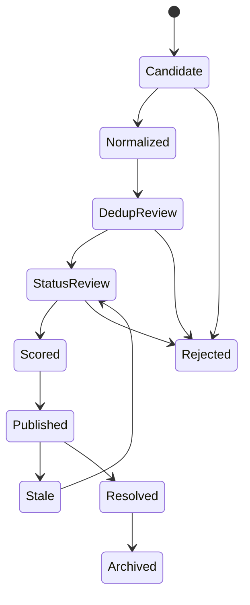

# 02 · 领域模型与 Schema（Problem Card 数据模型 / 生命周期状态机）

> 文档版本：v1.0.0  
> 文档状态：基线拆分稿（源：设计规范 v0.1 §9、§10）  
> 更新日期：2026-08-28  
> 上游基线：《AI_Math_Problem_Draw_Agent_Design_Spec_v0.1 (1).md》（下称"设计规范"，只读；本文为其忠实拆分稿，不新增承诺、不改变任何决策）

---

## 1. Problem Card 数据模型（设计规范 §9）

Problem Card 是一张可引用、可核验、可版本化的数学开放问题卡，是问题在系统中的核心知识实体（设计规范 §3.1）。它不是一段摘要。

### 1.1 核心 Schema（设计规范 §9.1，YAML 原样保留）

```yaml
problem_id: OP-000142
schema_version: 1.0.0

identity:
  title: "Canonical problem title"
  aliases: []
  slug: canonical-problem-title
  problem_family_id:

statements:
  original:
    text:
    latex:
    language:
    source_id:
    source_location:
    immutable_content_hash:
  normalized:
    text:
    latex:
    assumptions: []
    quantified_objects: []
    normalization_notes: []
    semantic_risks: []
  reader_summary:
    one_sentence:
    short_background:
    why_it_matters:

classification:
  primary_domain:
  secondary_domains: []
  topics: []
  problem_types: []
  expected_output_types: []
  mathematical_objects: []

provenance:
  original_proposer: []
  original_year:
  original_work:
  exact_citation:
  source_urls: []
  discovery_method:
  discovered_at:

open_status:
  status: status_uncertain
  confidence_level: limited
  last_checked_at:
  supporting_evidence: []
  contradicting_evidence: []
  resolved_scope:
  human_verified: false

known_results:
  special_cases: []
  best_known_bounds: []
  known_equivalences: []
  attempted_methods: []
  blocking_obstacles: []

relationships:
  equivalent_to: []
  generalizes: []
  special_case_of: []
  implies: []
  implied_by: []
  related_to: []

importance_assessment:
  evidence: []
  feature_values: {}
  score_band:
  uncertainty:
  rubric_version:

ai_affordance_assessment:
  evidence_for: []
  evidence_against: []
  unknowns: []
  feature_values: {}
  score_band:
  uncertainty:
  rubric_version:

publication:
  lifecycle_state: candidate
  publishable: false
  visibility: internal

audit:
  created_by:
  created_at:
  updated_at:
  current_version:
  model_runs: []
  human_reviews: []
```

### 1.2 不可变字段（设计规范 §9.2）

下列内容只能新增版本，不能原地覆盖：

- 原始问题陈述；
- 原始来源定位；
- 原始网页、PDF 或 LaTeX 内容指纹；
- Agent 的原始结构化输出；
- 人工审核记录；
- 发布和状态变更历史。

### 1.3 领域扩展 Schema（设计规范 §9.3）

统一核心 Schema 之外，允许领域插件增加字段：

- 数论：整数搜索范围、局部—整体结构、数据库支持；
- 组合与图论：有限规模验证、极值界、构造编码；
- PDE：函数空间、正则性条件、边界条件、数值证据；
- 代数几何：基域、特征、模空间、计算代数支持；
- 几何与拓扑：维数、不变量、分类范围、低维特殊情形。

领域插件不得改变核心状态机和证据规则。

---

## 2. 生命周期状态机（设计规范 §10）



### 2.1 允许的开放状态（设计规范 §10.1）

```text
confirmed_open
likely_open
status_uncertain
partially_resolved
resolved
withdrawn_or_malformed
```

### 2.2 发布门禁（设计规范 §10.2）

进入 `Published` 至少满足：

- 原始陈述和精确来源存在；
- 规范化陈述通过 Schema 校验；
- 完成疑似重复检查；
- 开放状态不为 `resolved` 或 `withdrawn_or_malformed`；
- 重要性和 AI 友好性均包含证据；
- 所有关键判断带时间戳和 rubric 版本；
- 未人工确认的内容明确标记；
- 不存在 P0 风险阻塞项。

严禁：

```text
网页搜索 -> LLM 打分 -> 自动发布
```

---

## 3. 与本仓库 JSON Schema 的对应

（本节为本仓库补充，只描述既有实现与基线的对应关系，不改变上方基线语义。）

### 3.1 机器可校验实现

`schemas/problem_card/schema.json`（`$id: https://ai-math-recommend.dev/schemas/problem_card/v1.0.0/schema.json`，JSON Schema draft 2020-12）是本文 §1 领域模型的机器可校验实现：

- 顶层对象与必填字段与 §1.1 YAML 的顶层键一一对应；
- `open_status.status` 枚举与 §2.1 开放状态完全一致（含描述"没有找到证明不等于仍然开放；未核验声称不得单独翻转状态"）；
- `publication.lifecycle_state` 枚举（`candidate / normalized / dedup_review / status_review / scored / published / rejected / stale / resolved / archived`）与 §2 状态机各状态一一对应；
- 实现层在 `publication` 下补充了 `publish_blockers` 等工程字段，`classification.primary_domain` 取值须在 `data/taxonomies/domains.json` 登记；这些是实现细节，不改变基线语义。

### 3.2 六族 Schema 清单

本仓库以六族 JSON Schema 覆盖领域契约，均位于 `schemas/<族名>/schema.json`（目录内文件恒为最新版）。除 source_registry 已升 **v1.1.0**（ADR-013：新增可选 `priority_tier` 与 `connector_name`，v1.0.0 实例全部兼容）外，其余五族均为 v1.0.0：

| 族 | 路径 | 作用 |
|---|---|---|
| problem_card | `schemas/problem_card/schema.json` | 问题卡核心模式（本文 §1） |
| evidence | `schemas/evidence/schema.json` | 证据条目，被问题卡内嵌引用（本文 §3.3） |
| review | `schemas/review/schema.json` | 专家审核决定（对应流水线 P7，见《docs/04_INGESTION_AND_CURATION_SOP.md》§2） |
| attempt | `schemas/attempt/schema.json` | 未来求解运行记录（设计规范 §14.3） |
| source_registry | `schemas/source_registry/schema.json` | 数据源登记条目（见《docs/03_DATA_SOURCE_REGISTRY.md》§2） |
| agent_task_contract | `schemas/agent_task_contract/schema.json` | Agent 任务契约（见《docs/04_INGESTION_AND_CURATION_SOP.md》§1） |

### 3.3 evidence 条目内嵌于问题卡

证据不是独立旁路存储，而是内嵌于问题卡：问题卡 Schema 通过内部定义 `evidence_ref` 直接引用 evidence 族 Schema（`https://ai-math-recommend.dev/schemas/evidence/v1.0.0/schema.json`），`open_status.supporting_evidence`、`open_status.contradicting_evidence` 与关系条目的证据数组均由该引用构成；重要性 / AI 友好性评估在领域模型中同样以证据数组表达（§1.1 YAML）。每条证据必填 `evidence_id`、`kind`、`description`、`verification_status`。

`kind` 枚举含义（证据类型）：

| 取值 | 含义 |
|---|---|
| `source_quote` | 来源原文摘录 |
| `document_link` | 可定位文献 / 网页 |
| `computed_metric` | 程序计算的引用等指标 |
| `program_output` | 计算验证输出 |
| `model_inference` | Agent 推断（非事实） |
| `expert_judgment` | 人类专家判断 |
| `unverified_claim` | 外部未核验声称（如预印本证明声称，只可进矛盾队列，不得单独定论） |

`verification_status` 枚举含义（核验状态）：

| 取值 | 含义 |
|---|---|
| `verified` | 已由可信来源或人工确认 |
| `unverified` | 未核验 |
| `disputed` | 社群存在争议 |
| `contradicted` | 已被后续证据反驳 |
| `superseded` | 已被更强证据取代 |

证据条目另含 `tier`（`A/B/C/D/internal`，对应数据源分级，见《docs/03_DATA_SOURCE_REGISTRY.md》§1）与 `source_id`（引用 Source Registry 登记条目 `SRC-xxxx`）。

### 3.4 状态机的强制执行

状态机合法迁移表由 `packages/domain` 强制执行：问题卡 Schema 中 `publication.lifecycle_state` 只约束取值合法性，不约束迁移合法性；任何非法迁移（如 `Candidate -> Published`）必须在领域层被拒绝。Agent 不得绕过状态机写入状态（Agent 执行纪律见《docs/04_INGESTION_AND_CURATION_SOP.md》§1.2）。

---

## 4. 待裁决问题

以下问题在拆分时发现；第 1/2/3/5 项已随 Phase 0 执行与 ADR-009 裁决（标注如下），第 4 项转 ADR Backlog（B-08）：

1. 状态命名书写不一致 → **已裁决（ADR-009）**：以问题卡 Schema 的小写下划线写法（`candidate`…）为唯一规范；mermaid 大驼峰到规范的映射表见 `packages/domain/src/ai_math_domain/enums.py` 的 `PASCAL_TO_LOWER`。
2. 终态边界空白 → **已裁定（ADR-009 附注）**：`rejected` 与 `archived` 按绝对终态实现（`state_machine.py` 的 `TERMINAL_STATES`）；如需软恢复，走"新建卡 + 关系回指"并在新 ADR 中放开（Backlog B-14）。
3. 发布前发现已解决的路径空白 → **已裁定（保守策略）**：任何非 `published` 状态不得直接迁移到 `resolved`；此类发现由 P7 人工裁决处理（见 `state_machine.py` 模块注释与 ADR-009）。
4. 设计规范 §26 第 10 条（何时将 `likely_open` 自动降级为 `Stale`）为上游已登记的开放设计问题，本文不裁决，仅登记关联（Backlog B-08）。
5. ~~`packages/domain` 状态机代码未落地~~ → **已落地**（2026-08-28）：`packages/domain/src/ai_math_domain/state_machine.py` 的 `TRANSITIONS` 逐边转录 §2 mermaid 图（12 条合法边，`Rejected`/`Archived` 终态），非法迁移抛 `LifecycleError`，测试逐边锁定（tests/unit/test_state_machine.py）；另有 `publish_gate.py` 实现 §3 发布门禁（含 ADR-012 的 gate-p7 人工批准硬闸）与 Pydantic 镜像 `models.py`。
